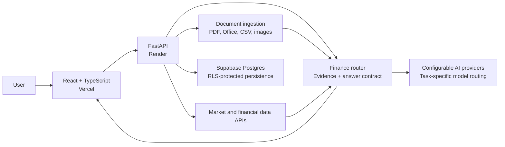

# QFin Terminal

**Learn finance by asking, uploading, comparing, building, and discussing.**

[Live app](https://q-fin-terminal.vercel.app/) · [API status](https://qfin-terminal.onrender.com/health) · [Hackathon submission](docs/HACKATHON_SUBMISSION.md)

QFin Terminal is an AI-powered finance learning and research workspace built with Codex and GPT-5.6 for OpenAI Build Week. It combines grounded company analysis, document understanding, market news, community discussions, and interactive trading-model education in one approachable interface.

QFin gathers financial evidence before generating an explanation. Its provider-compatible backend applies the same answer structure across configured models and keeps private credentials away from the browser.

> QFin is an educational research tool, not financial advice or a brokerage service.

## What You Can Do

| Feature | Description |
| --- | --- |
| Ask QFin | Research companies, compare investments, and learn finance concepts through structured answers. |
| Analyze files | Upload PDF, XLSX, XLS, CSV, DOCX, or financial images for evidence-grounded analysis. |
| Follow markets | Browse categorized news for stocks, crypto, bonds, ETFs, and other markets. |
| Join the community | Publish discussions, vote on ideas, and comment on forum threads. |
| Explore models | Learn from community trading models, including Monte Carlo simulations. |
| Build models | Write, run, save privately, or publish a model from the browser. |
| Save research | Keep conversations, watchlist topics, private models, and model runs in Reports & Watchlist. |

## Architecture



All AI, financial-data, and Supabase service-role requests run through the backend. The frontend receives only public application data.

## Technology

| Layer | Stack |
| --- | --- |
| Frontend | React 19, TypeScript, Vite |
| Backend | Python, FastAPI, Pydantic, HTTPX |
| Data | Supabase Postgres, row-level security, financial-data APIs |
| Files | pypdf, pdfplumber, pandas, openpyxl, python-docx |
| Hosting | Vercel frontend, Render backend |
| AI | OpenAI-compatible provider client with task-specific routing and fallbacks |

## Quick Start

### 1. Clone the repository

```bash
git clone https://github.com/jamienatorX/QFin-Terminal.git
cd QFin-Terminal
```

### 2. Start the backend

```bash
cd backend
python -m venv .venv
```

Activate the environment:

```powershell
# Windows PowerShell
.\.venv\Scripts\Activate.ps1
```

```bash
# macOS or Linux
source .venv/bin/activate
```

Install dependencies, copy the configuration template, and start FastAPI:

```bash
pip install -r requirements.txt
cp .env.example .env
uvicorn main:app --reload
```

On Windows Command Prompt, use `copy .env.example .env` instead of `cp`.

The backend runs at `http://127.0.0.1:8000`. Open [the health endpoint](http://127.0.0.1:8000/health) or [API documentation](http://127.0.0.1:8000/docs) to verify it.

### 3. Start the frontend

In a second terminal:

```bash
cd frontend
npm install
cp .env.example .env.local
npm run dev
```

Set `VITE_API_BASE_URL=http://127.0.0.1:8000` in `frontend/.env.local` when using the local backend. The app runs at `http://localhost:5173`.

## Configuration

Use [backend/.env.example](backend/.env.example) and [frontend/.env.example](frontend/.env.example) as the source of truth. The main groups are:

| Variables | Purpose |
| --- | --- |
| `AI_PROVIDER_*` | Provider endpoint, API key, model routing, token budgets, and timeouts. |
| `SUPABASE_URL`, `SUPABASE_SERVICE_ROLE_KEY` | Persistent reports, watchlists, forum content, models, and financial warehouse data. |
| `FMP_API_KEY`, `FINNHUB_API_KEY`, `NEWSAPI_KEY` | Optional market, fundamental, and news enrichment. |
| `ALLOWED_ORIGINS` | Frontend origins permitted by backend CORS policy. |
| `VITE_API_BASE_URL` | Public backend URL used by the frontend. |

Never commit `.env`, `.env.local`, API keys, or service-role credentials.

## Database

Run [supabase/schema.sql](supabase/schema.sql) in the Supabase SQL editor. It creates the community, reports, watchlist, model, symbol, and financial-warehouse tables together with row-level security policies.

Browser clients never receive the Supabase service-role key. Public and owner-specific access is enforced by backend authorization and database policies.

## Verification

Run the backend suite:

```bash
cd backend
python -m unittest discover -s tests -v
```

Build the production frontend:

```bash
cd frontend
npm install
npm run build
```

The current release passes **102 backend tests** covering routing, answer formatting, company and comparison analysis, uploads, persistence, provider fallbacks, and API security.

## Deployment

- [vercel.json](vercel.json) configures the React production build on Vercel.
- [render.yaml](render.yaml) configures the FastAPI service on Render.
- Pushes to `main` trigger the connected production deployments.
- Set production secrets in the provider dashboards, never in GitHub.

See [Render and Vercel deployment](docs/RENDER_VERCEL_BACKEND.md) for the complete environment and hosting checklist.

## Repository Guide

```text
QFin-Terminal/
├── backend/          FastAPI routes, finance engine, AI client, and file ingestion
├── frontend/         React application and typed API/domain boundaries
├── supabase/         Postgres schema and security policies
├── docs/             Architecture, security, deployment, and submission material
├── render.yaml       Render service configuration
└── vercel.json       Vercel build configuration
```

Useful references:

- [Security hardening](docs/SECURITY_HARDENING.md)
- [Agent architecture research](docs/agent-architecture-research.md)
- [Financial data warehouse](docs/FINANCIAL_DATA_WAREHOUSE.md)
- [Public API registry](docs/agent-public-api-registry.md)

## License

[MIT](LICENSE)
