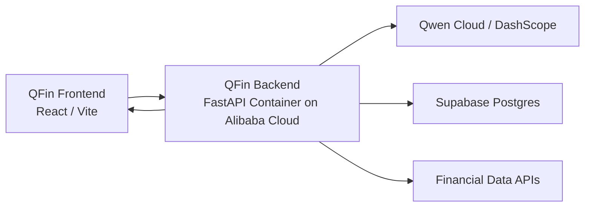

# Alibaba Cloud Backend Deployment

QFin Terminal's backend is a FastAPI service. The easiest Alibaba Cloud migration path is to run the backend as a container while keeping the frontend, Supabase database, and Qwen Cloud-compatible model calls unchanged.

## Target Architecture



## Backend Environment Variables

Set these in Alibaba Cloud, not in frontend code and not in GitHub:

```env
APP_ENV=production
ADMIN_API_KEY=replace_me
DASHSCOPE_API_KEY=replace_me
DASHSCOPE_BASE_URL=https://dashscope-intl.aliyuncs.com/compatible-mode/v1
DASHSCOPE_MODEL=glm-5.2
DASHSCOPE_MODEL_FAST=glm-5.2
DASHSCOPE_MODEL_DEEP=glm-5.2
DASHSCOPE_MODEL_FLASH=glm-5.1
DASHSCOPE_MODEL_VISION=qwen-vl-plus-latest
DASHSCOPE_TIMEOUT_SECONDS=45
DASHSCOPE_TOTAL_TIMEOUT_SECONDS=75
SUPABASE_URL=replace_me
SUPABASE_SERVICE_ROLE_KEY=replace_me
FMP_API_KEY=replace_me
FINNHUB_API_KEY=replace_me
NEWSAPI_KEY=replace_me
ALLOWED_ORIGINS=https://q-fin-terminal.vercel.app,http://localhost:5173,http://127.0.0.1:5173
```

## Container Build

From the `backend` directory:

```bash
docker build -t qfin-terminal-api .
```

Run locally:

```bash
docker run --env-file .env -p 8000:8000 qfin-terminal-api
```

Health check:

```text
http://localhost:8000/health
```

## Frontend Change After Deployment

After the Alibaba Cloud backend has a public HTTPS URL, set the frontend environment variable:

```env
VITE_API_BASE_URL=https://your-alibaba-backend-url
```

Then redeploy the frontend.

## Hackathon Proof

For the hackathon submission, use:

- The public Alibaba Cloud backend URL.
- A screenshot or deployment page showing the backend service running on Alibaba Cloud.
- The code files `backend/Dockerfile`, `backend/server.py`, `backend/main.py`, and `backend/qwen_client.py` as proof that the backend runs QFin and calls Qwen Cloud-compatible APIs.
