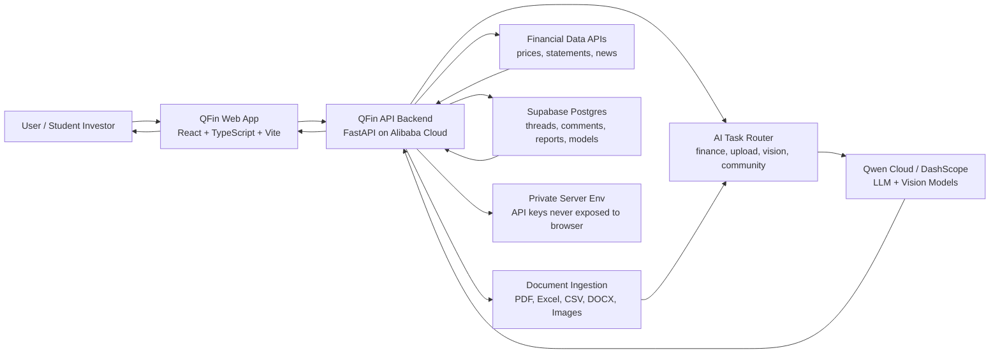

# QFin Terminal Hackathon Submission

## Elevator Pitch

QFin Terminal is an AI finance command center that turns annual reports, spreadsheets, charts, and market questions into clear beginner-friendly insights using Qwen Cloud-compatible AI.

## Built With

- Qwen Cloud
- DashScope
- Qwen VL
- GLM
- React
- TypeScript
- Vite
- Python
- FastAPI
- Supabase
- PostgreSQL
- Alibaba Cloud
- Render
- GitHub
- Financial Data APIs
- PDF Analysis
- Excel Analysis
- CSV Analysis
- Image Analysis
- Document AI
- AI Chatbot
- Community Forum
- Stock Research
- Tailwind CSS
- REST API

## Recommended Track

Track 4: Autopilot Agent

QFin fits this track because it automates a real financial research workflow: a user can ask a question, upload financial material, receive AI-assisted analysis, compare market data, and publish or discuss ideas with the community.

## About The Project

### Inspiration

I have always wanted to learn finance from scratch, but most finance platforms on the internet feel too complex for beginners. They often assume users already understand financial statements, valuation, ratios, markets, and investing language.

That inspired me to build QFin Terminal: an AI chatbot made specifically for finance, combined with a community forum where users can ask questions, upload financial documents, share ideas, and learn together.

### What it does

QFin Terminal is an AI-powered finance workspace. Users can chat with a finance-focused assistant, ask questions about companies, compare stocks, and upload files such as PDFs, Excel files, CSV files, documents, and images for analysis.

The chatbot can summarize annual reports, explain financial statements, identify risks, compare companies, and turn complicated finance data into beginner-friendly explanations. QFin also includes a community area where users can post finance discussions, comment on threads, share model ideas, and publish builder models into a shared gallery.

The goal is to make financial research feel less intimidating, more interactive, and more useful for people who are still learning.

### How we built it

QFin Terminal is built as a full-stack web application. The frontend is built with React, TypeScript, and Vite. The backend is built with Python and FastAPI. Supabase and PostgreSQL power persistent community features, saved models, reports, and discussion data.

The AI layer connects to Qwen Cloud-compatible APIs through DashScope. The backend routes different tasks to different models: quick questions can use faster text models, deeper finance analysis can use stronger reasoning models, and uploaded screenshots or chart images can use a vision model.

For the Alibaba Cloud version, the FastAPI backend can be deployed to Alibaba Cloud so the project demonstrates Alibaba Cloud infrastructure in addition to Qwen Cloud model usage. The backend keeps all private keys server-side, while the frontend only talks to the public API endpoint.

### What we learned

We learned that a useful AI finance product needs more than a chat box. It needs file ingestion, reliable model routing, market data, community persistence, security hardening, and a user experience that makes finance feel approachable.

We also learned how important fallback design is. Model quotas, cloud configuration, and file formats can all fail in different ways, so QFin is designed to route requests, parse files safely, and keep the user focused on the finance question instead of the infrastructure.

### What's next for QFin Terminal

Next, we want to add a best-price execution feature that compares available buying and selling prices across connected stock exchanges. When an investor wants to buy a stock, the system would try to find the lowest available selling price. When an investor wants to sell, it would look for the highest available buying price. This could help users receive more competitive execution prices and potentially reduce trading costs.

We also want to add trading signals connected to real-time stock exchange dashboards around the world. Traders could use these signals to learn how markets move, study different strategies, and better understand global financial opportunities.

Long term, QFin Terminal can become a complete AI finance copilot for learning, research, community discussion, portfolio analysis, and market execution.

## Architecture Diagram

## Alibaba Cloud Backend Migration Plan

The current backend is a Python FastAPI service and can be moved from Render to Alibaba Cloud with minimal application changes.

Recommended first deployment path:

1. Deploy the FastAPI backend to Alibaba Cloud ECS or a container-based Alibaba Cloud service.
2. Set the backend environment variables in Alibaba Cloud, including `DASHSCOPE_API_KEY`, `DASHSCOPE_BASE_URL`, model names, Supabase keys, and market data keys.
3. Point the frontend environment variable `VITE_API_BASE_URL` to the Alibaba Cloud backend URL.
4. Confirm `/health` returns `qwen_configured: true` and `supabase_configured: true`.
5. Use the Alibaba-hosted backend URL as proof of Alibaba Cloud deployment in the hackathon submission.

Proof file candidates for judges:

- `backend/qwen_client.py`, which shows Qwen Cloud / DashScope model calls.
- `backend/main.py`, which exposes the FastAPI backend and AI/file/community routes.
- A future Alibaba deployment file such as `alibaba-cloud.md`, `Dockerfile`, or deployment screenshot once the cloud service is live.

## Creative Pitch Video Script With Recording Plan

Target length: 2 minutes 15 seconds to 2 minutes 45 seconds.

### Scene 1: The Hook

What to record:

- Screen recording of a messy annual report PDF or financial statement.
- Slowly switch to the clean QFin Terminal homepage.

Voiceover:

> Finance should not feel like walking into a cockpit with every button flashing at once. For beginners, annual reports, ratios, market news, and valuation models can feel like a foreign language. QFin Terminal is built to translate that language.

### Scene 2: Introduce QFin

What to record:

- Show the QFin homepage.
- Click into the AI chat area.
- Show the backend connected status if visible.

Voiceover:

> QFin Terminal is an AI finance command center. You can ask it about a company, upload financial documents, compare stocks, or turn complicated market data into plain English. It is not trying to replace learning finance. It is trying to make learning finance possible.

### Scene 3: Ask A Finance Question

What to record:

- Type a simple prompt, for example: "Explain Apple's financial health like I am new to finance."
- Show the AI response appearing.

Voiceover:

> Instead of searching through ten tabs, users can start with one simple question. QFin reads the request, routes it through the backend, calls Qwen Cloud-compatible models, and brings back a focused finance explanation.

### Scene 4: Upload A Document

What to record:

- Upload a PDF, CSV, Excel file, or image of a financial table.
- Ask: "Analyze this and tell me the main financial risks."
- Show the response.

Voiceover:

> The most important finance information is often trapped inside files: annual reports, spreadsheets, CSV exports, and screenshots. QFin can bring those files into the conversation, so users can ask questions directly against the material they are studying.

### Scene 5: Community

What to record:

- Open the Community tab.
- Show threads, comments, or model gallery.
- If possible, create a short thread like "What ratio should beginners learn first?"

Voiceover:

> Finance is easier when people learn together. QFin includes a community space where users can post ideas, discuss markets, comment on threads, and share builder models. The goal is to turn finance research from a lonely process into a shared learning loop.

### Scene 6: Architecture

What to record:

- Show the architecture diagram from this document or create a simple slide from it.
- Highlight frontend, backend, Qwen Cloud, Alibaba Cloud, Supabase, and financial APIs.

Voiceover:

> Under the hood, QFin uses a React frontend, a FastAPI backend, Qwen Cloud-compatible AI models through DashScope, Supabase Postgres for persistence, and financial data APIs for market context. The Alibaba Cloud backend keeps private keys server-side and gives the app a production deployment path for judging.

### Scene 7: Future Vision

What to record:

- Show a dashboard, market cards, or model gallery.
- Optional: overlay text reading "Best-price execution" and "Real-time trading signals."

Voiceover:

> Next, QFin will move from explaining markets to helping users act smarter inside them. We want to add best-price execution across connected exchanges, plus real-time trading signals for global markets. The long-term vision is simple: one AI terminal where people can learn, research, discuss, and make better financial decisions.

### Scene 8: Closing Line

What to record:

- Return to the QFin homepage or chat response.
- End on the project name.

Voiceover:

> QFin Terminal turns finance from a wall of numbers into a conversation. Ask, upload, understand, and learn faster.

## Shorter 60-Second Backup Script

What to record:

- 10 seconds homepage.
- 15 seconds AI chat question.
- 15 seconds file upload analysis.
- 10 seconds community.
- 10 seconds architecture or future vision.

Voiceover:

> QFin Terminal is an AI finance command center for people who want to learn investing without getting buried in complexity.
>
> Users can ask finance questions, upload annual reports, spreadsheets, CSV files, documents, or screenshots, and get beginner-friendly explanations powered by Qwen Cloud-compatible AI.
>
> QFin also includes a community space where users can post threads, comment on ideas, and publish finance models into a shared gallery.
>
> The app is built with React, TypeScript, FastAPI, Supabase, Alibaba Cloud-ready backend deployment, and DashScope model routing for text and vision analysis.
>
> QFin turns finance from a wall of numbers into a conversation: ask, upload, understand, and learn faster.
