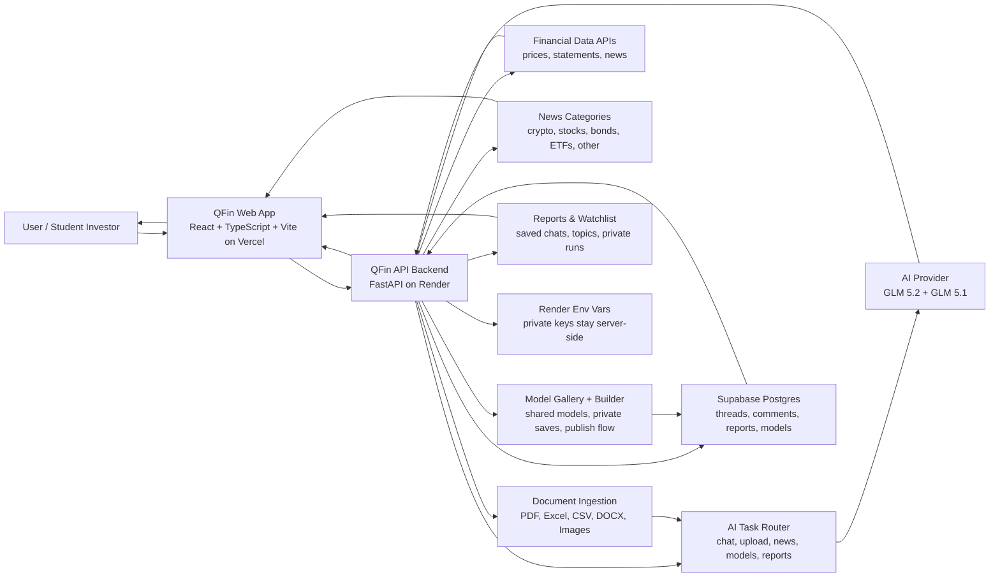

# QFin Terminal OpenAI Build Week Submission

## Category

Education

## Elevator Pitch

QFin Terminal is an AI finance learning terminal that turns annual reports, spreadsheets, market news, community ideas, and trading models into clear beginner-friendly explanations.

## Built With

- Codex
- GPT-5.6
- GLM 5.2
- GLM 5.1
- React
- TypeScript
- Vite
- Python
- FastAPI
- Render
- Vercel
- Supabase
- PostgreSQL
- Financial Data APIs
- PDF Analysis
- Excel Analysis
- CSV Analysis
- Image Analysis
- Document AI
- AI Chatbot
- Community Forum
- Reports & Watchlist
- Model Builder
- Stock Research
- Tailwind-style CSS
- REST API

## Short Submission Answer

I am building QFin Terminal for the Education category. QFin is an AI finance learning platform built with Codex and GPT-5.6 that helps users understand companies, annual reports, spreadsheets, market news, and trading models through chat, file analysis, community discussion, reports/watchlists, and an interactive model builder.

## About The Project

### Inspiration

I have always wanted to learn finance from scratch, but many finance platforms feel too complex for beginners. They often assume users already understand financial statements, valuation, ratios, markets, and investing language.

That inspired me to build QFin Terminal: an AI finance learning workspace where users can ask questions, upload documents, browse market news by category, discuss finance ideas, and learn from community trading models.

### What it does

QFin Terminal is an AI-powered finance workspace. Users can chat with a finance-focused assistant, ask questions about companies, compare stocks, and upload files such as PDFs, Excel files, CSV files, documents, and images for analysis.

The chatbot can summarize annual reports, explain financial statements, identify risks, compare companies, and turn complicated finance data into beginner-friendly explanations.

QFin also includes a news section with multiple finance categories, so users can learn through the market topics they already care about, such as crypto, stocks, bonds, ETFs, and other asset classes. Instead of forcing everyone through the same finance path, QFin lets each person explore markets from their own interest area.

The community section lets users post finance discussions, comment on threads, and learn with other users. The model gallery lets users study trading and research models shared by the community. The builder section lets users create their own finance model directly inside the website and run it privately or publish it to the shared gallery.

For example, a user can build a Monte Carlo trading model that simulates many possible price paths, estimates return ranges, and teaches why risk and probability matter more than one single prediction.

Reports & Watchlist gives users a private shelf where they can save AI conversations, watchlist topics, private models, and private model runs. It does not have to be only stocks: users can save sectors, crypto ideas, macro themes, bond topics, strategy notes, or anything they want to revisit.

### How we built it

QFin Terminal is a full-stack web application. The frontend is built with React, TypeScript, and Vite, deployed on Vercel. The backend is built with Python and FastAPI, deployed on Render. Supabase and PostgreSQL power persistent community features, saved models, reports, watchlists, and discussion data.

The AI layer uses a provider-compatible backend client with GLM 5.2 for deeper analysis and GLM 5.1 for faster fallback responses. QFin keeps private keys on the backend and uses route-specific logic so different tasks can be handled differently: chat, finance analysis, news, document upload analysis, community models, and builder runs.

Codex with GPT-5.6 accelerated the project by helping design the architecture, implement backend routes, improve file upload handling, add forum comments, build the Reports & Watchlist feature, harden security, fix deployment failures, test model routing, and iterate on the submission/video materials.

### What we learned

We learned that a useful AI finance product needs more than a chat box. It needs file ingestion, reliable model routing, market data, community persistence, saved research, security hardening, and a user experience that makes finance feel approachable.

We also learned how important fallback design is. Model quotas, cloud configuration, and file formats can fail in different ways, so QFin is designed to route requests, parse files safely, and keep the user focused on learning finance instead of debugging infrastructure.

### What's next for QFin Terminal

Next, we want to add a best-price execution feature that compares available buying and selling prices across connected stock exchanges. When an investor wants to buy a stock, the system would try to find the lowest available selling price. When an investor wants to sell, it would look for the highest available buying price. This could help users receive more competitive execution prices and potentially reduce trading costs.

We also want to add trading signals connected to real-time stock exchange dashboards around the world. Traders could use these signals to learn how markets move, study different strategies, and better understand global financial opportunities.

Long term, QFin Terminal can become a complete AI finance copilot for learning, research, community discussion, portfolio analysis, and market execution.

## Architecture Diagram

## Creative Pitch Video Script With Recording Plan

Target length: 2 minutes 15 seconds to 2 minutes 45 seconds.

### Scene 1: The Hook

What to record:

- Screen recording of a messy annual report PDF or financial statement.
- Slowly switch to the clean QFin Terminal homepage.

Voiceover:

> Finance should not feel like walking into a cockpit with every button flashing at once. For beginners, annual reports, ratios, market news, and valuation models can feel like a foreign language. QFin Terminal is built to translate that language.

### Scene 2: Introduce QFin

What to record:

- Show the QFin homepage.
- Click into the AI chat area.
- Show the backend connected status if visible.

Voiceover:

> QFin Terminal is an AI finance learning command center. You can ask it about a company, upload financial documents, compare stocks, follow market news, save research, or build a trading model. It is not trying to replace learning finance. It is trying to make learning finance possible.

### Scene 3: Ask A Finance Question

What to record:

- Type: "Explain Apple's financial health like I am new to finance."
- Show the AI response appearing.

Voiceover:

> Instead of searching through ten tabs, users can start with one simple question. QFin reads the request, routes it through the backend, gathers finance context, and brings back a clear explanation.

### Scene 4: Upload A Document

What to record:

- Upload a PDF, CSV, Excel file, or image of a financial table.
- Ask: "Analyze this and tell me the main financial risks."
- Show the response.

Voiceover:

> The most important finance information is often trapped inside files: annual reports, spreadsheets, CSV exports, and screenshots. QFin brings those files into the conversation, so users can ask questions directly against the material they are studying.

### Scene 5: News Learning Paths

What to record:

- Open the Community tab.
- Click through Crypto, Stocks, Bonds, ETFs, and Other.
- Show each category’s market learning feed.

Voiceover:

> Not everyone enters finance from the same door. Some people start with crypto, some with stocks, some with bonds, and some just want to understand ETFs. QFin has category-based news so users can learn through the market stories they already care about.

### Scene 6: Community Threads

What to record:

- Show forum threads and comments.
- Create or open a thread like "What ratio should beginners learn first?"
- Show the comment box.

Voiceover:

> Finance is easier when people learn together. QFin includes community threads where users can post ideas, ask beginner questions, discuss market news, and comment on each other's posts.

### Scene 7: Model Gallery

What to record:

- Open the Models section.
- Scroll through shared trading or research model cards.
- Click or hover on one model that looks useful.

Voiceover:

> QFin also has a model gallery. This is where users can learn from trading models and research models created by other people. A beginner can study how another user thinks about a strategy, what data they use, what risk controls matter, and how the model might be adapted.

### Scene 8: Builder Studio

What to record:

- Open the Builder section.
- Show "Monte Carlo Simulator - GBM Paths."
- Show ticker, notes, code, Save privately, Publish, and Run privately.
- Run or preview the model card.

Voiceover:

> The builder is where QFin becomes more than a reading tool. Users can type and deploy their own model directly inside the website. A Monte Carlo trading model can simulate thousands of possible price paths and show why finance is not about guessing one perfect future. It is about understanding probability, risk, and decision-making under uncertainty.

### Scene 9: Reports & Watchlist

What to record:

- Click Reports & Watchlist.
- Add a topic that is not a stock, like "AI chips" or "10-year Treasury yields."
- Show saved conversations or private model runs.

Voiceover:

> QFin also gives users a private research shelf. They can save conversations, watchlist topics, private model drafts, and private model runs. The watchlist does not have to be only stocks. It can be any company, sector, macro theme, crypto idea, or trading strategy the user wants to follow.

### Scene 10: Codex + Architecture

What to record:

- Show the architecture diagram from this document or create a simple slide from it.
- Highlight Codex, React/Vercel, FastAPI/Render, GLM, Supabase, financial APIs, news, model builder, and reports.

Voiceover:

> QFin was built with Codex and GPT-5.6. Codex helped build the backend routes, fix deployment issues, improve file uploads, add comments, create Reports & Watchlist, harden the API, and iterate on the product design. Under the hood, QFin uses a React frontend on Vercel, a FastAPI backend on Render, Supabase Postgres, financial data APIs, and GLM models for AI responses.

### Scene 11: Future Vision

What to record:

- Show a dashboard, market cards, or model gallery.
- Optional: overlay text reading "Best-price execution" and "Real-time trading signals."

Voiceover:

> Next, QFin will move from explaining markets to helping users act smarter inside them. We want to add best-price execution across connected exchanges, plus real-time trading signals for global markets. The long-term vision is simple: one AI terminal where people can learn, research, discuss, and make better financial decisions.

### Scene 12: Closing Line

What to record:

- Return to the QFin homepage or chat response.
- End on the project name.

Voiceover:

> QFin Terminal turns finance from a wall of numbers into a conversation. Ask, upload, understand, and learn faster.

## Shorter 60-Second Backup Script

What to record:

- 10 seconds homepage.
- 10 seconds AI chat question.
- 10 seconds file upload analysis.
- 10 seconds news categories.
- 10 seconds model gallery or builder.
- 10 seconds Reports & Watchlist or architecture.

Voiceover:

> QFin Terminal is an AI finance learning command center for people who want to understand investing without getting buried in complexity.
>
> Users can ask finance questions, upload annual reports, spreadsheets, CSV files, documents, or screenshots, and get beginner-friendly explanations.
>
> QFin also includes category-based market news, so users can learn from the topics they actually care about, whether that is crypto, stocks, bonds, ETFs, or other asset classes.
>
> The model gallery lets users learn from trading models shared by the community, while the builder lets users create and deploy their own models directly on the website.
>
> Reports & Watchlist lets users save conversations, topics, private model drafts, and private model runs.
>
> Built with Codex and GPT-5.6, QFin uses React, TypeScript, FastAPI, Render, Vercel, Supabase, financial data APIs, and GLM models to turn finance from a wall of numbers into a conversation.
