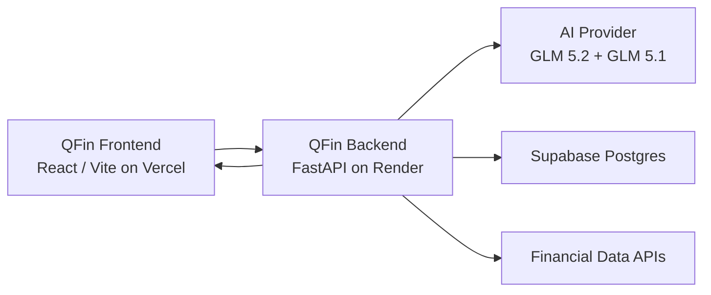

# Render + Vercel Backend Deployment

QFin Terminal uses a simple production deployment model:

- Frontend: React / Vite on Vercel.
- Backend: FastAPI on Render.
- Database: Supabase Postgres.
- AI runtime: GLM 5.2 / GLM 5.1 through an OpenAI-compatible provider endpoint.

## Target Architecture



## Backend Environment Variables

Set these in Render, not in frontend code and not in GitHub:

```env
APP_ENV=production
ADMIN_API_KEY=replace_me
AI_PROVIDER_API_KEY=replace_me
AI_PROVIDER_BASE_URL=https://dashscope-intl.aliyuncs.com/compatible-mode/v1
AI_PROVIDER_MODEL=glm-5.2
AI_PROVIDER_MODEL_FAST=glm-5.2
AI_PROVIDER_MODEL_DEEP=glm-5.2
AI_PROVIDER_MODEL_FLASH=glm-5.1
AI_PROVIDER_MODEL_VISION=glm-5.2
AI_PROVIDER_NEWS_MODEL=glm-5.2
AI_PROVIDER_TIMEOUT_SECONDS=45
AI_PROVIDER_TOTAL_TIMEOUT_SECONDS=75
SUPABASE_URL=replace_me
SUPABASE_SERVICE_ROLE_KEY=replace_me
FMP_API_KEY=replace_me
FINNHUB_API_KEY=replace_me
NEWSAPI_KEY=replace_me
ALLOWED_ORIGINS=https://q-fin-terminal.vercel.app,http://localhost:5173,http://127.0.0.1:5173
```

## Frontend Environment Variable

Set this in Vercel:

```env
VITE_API_BASE_URL=https://qfin-terminal.onrender.com
```

## Hackathon Proof

For OpenAI Build Week, the project should emphasize that Codex and GPT-5.6 were used to build, debug, harden, and iterate QFin Terminal. The runtime can stay on Render, Vercel, Supabase, and GLM models.

Useful repo files for judges:

- `backend/main.py`, which exposes the FastAPI backend and AI/file/community routes.
- `backend/qwen_client.py`, which currently contains the provider-compatible AI client and GLM routing.
- `render.yaml`, which shows the Render backend deployment.
- `vercel.json`, which shows the Vercel frontend deployment.
- `docs/HACKATHON_SUBMISSION.md`, which explains the product and demo script.
